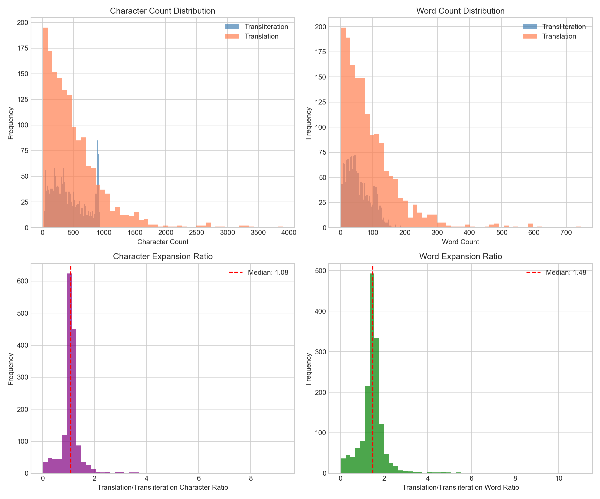
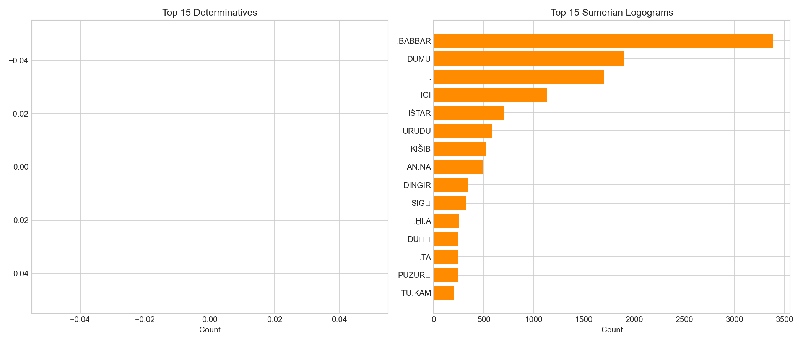
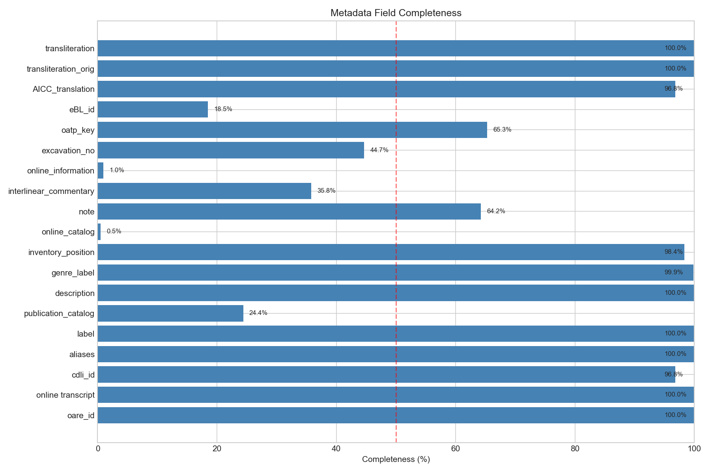
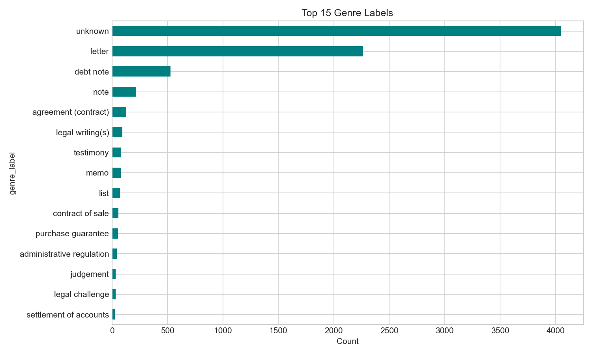
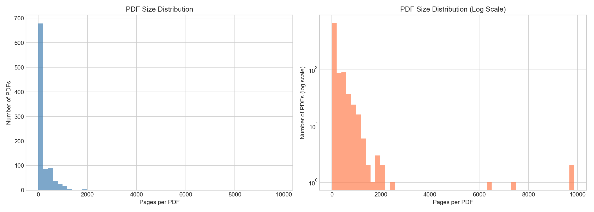
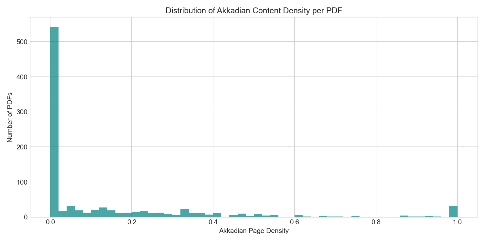
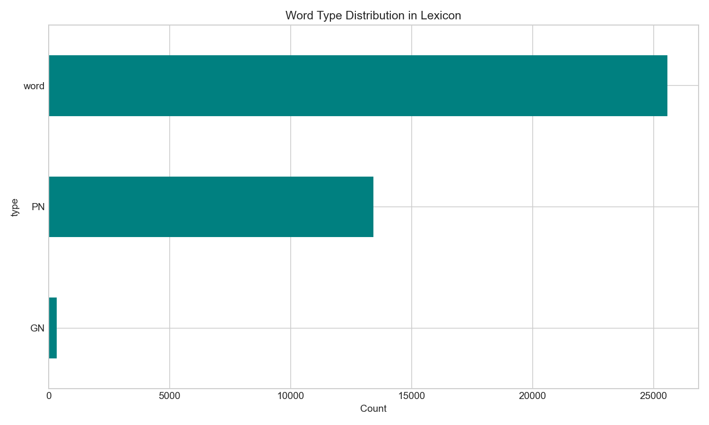
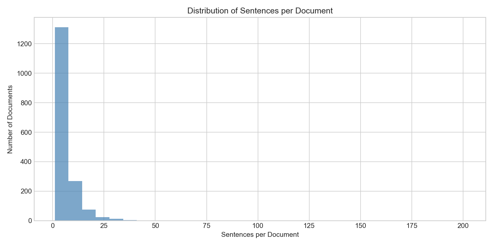
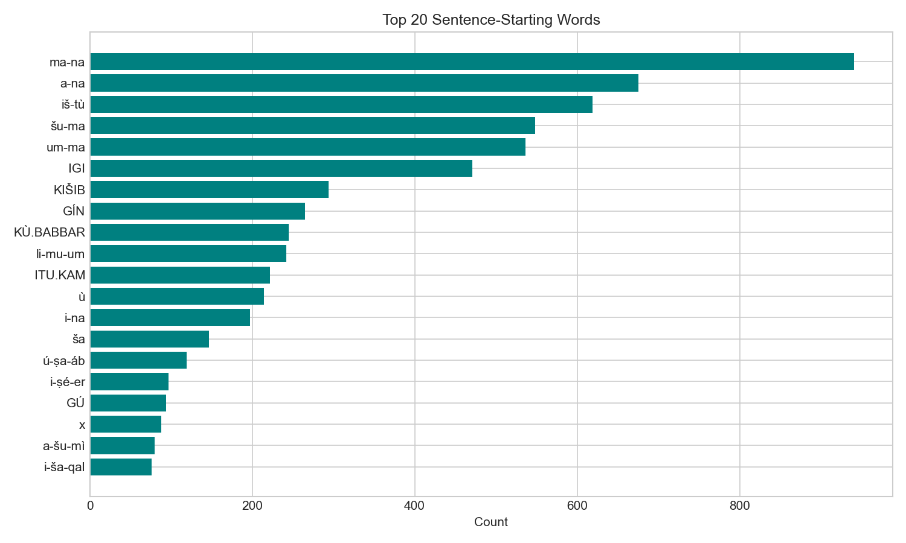
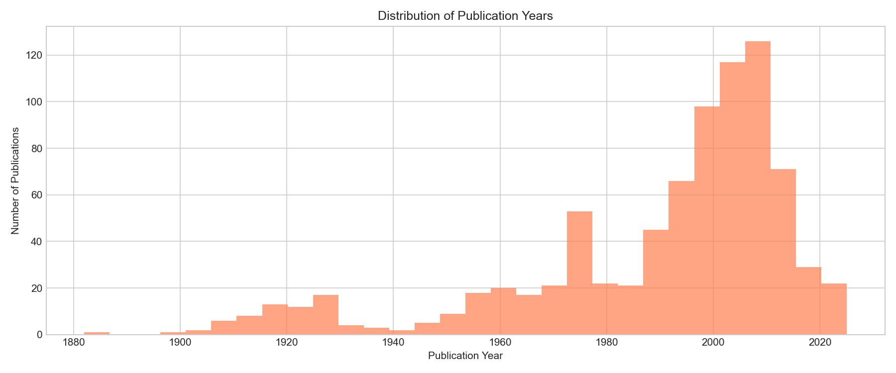

# Exploratory Data Analysis Report
## Deep Past Challenge: Translate Akkadian to English

**Date**: 2026-01-11  
**Competition**: [Kaggle Deep Past Challenge](https://kaggle.com/competitions/deep-past-initiative-machine-translation)  
**Metric**: Geometric Mean of BLEU and chrF++ scores

---

## Executive Summary

This competition challenges participants to build neural machine translation models for **Old Assyrian**, a 4,000-year-old Semitic language. The dataset represents the largest archive of ancient business records, with tablets documenting debts, caravans, and family matters from Bronze Age Mesopotamia.

### Key Findings

| Metric | Value |
|--------|-------|
| Training samples | 1,561 document-level translations |
| Published texts (no translation) | 6,388 |
| Sentence alignments available | 9,782 (from 1,700 documents) |
| OCR publications for extraction | 952 PDFs (~217K pages) |
| Lexicon entries | 39,332 word forms |
| Dictionary definitions | 15,344 |

### Critical Insights

1. **Low-resource challenge**: Only 1,561 training samples with document-level (not sentence-level) alignment
2. **Data augmentation potential**: 6,388 additional texts could be translated if extracted from publications.csv
3. **Morphological complexity**: Median word expansion ratio of 1.48× (Akkadian → English)
4. **Multilingual sources**: Publications contain ~66% English, 16% German, 7% French content

---

## 1. Training Data Analysis (`train.csv`)

### 1.1 Overview

| Statistic | Value |
|-----------|-------|
| Total samples | 1,561 |
| Missing values | 0 |
| Avg transliteration length | 426 chars / 58 words |
| Avg translation length | 500 chars / 91 words |

### 1.2 Text Length Distributions



**Key observations**:
- Translations are ~17% longer in characters but ~57% longer in words
- Median character expansion ratio: 1.08×
- Median word expansion ratio: 1.48×
- This reflects Akkadian's agglutinative morphology where one word encodes multiple English words

### 1.3 Vocabulary Statistics

| Metric | Transliteration | Translation |
|--------|-----------------|-------------|
| Total tokens | 89,807 | 141,267 |
| Unique tokens | 11,761 | 10,371 |

**Top transliteration tokens**: `a-na` (to), `ša` (of/that), `KÙ.BABBAR` (silver), `ma-na` (mina), `DUMU` (son)

**Top translation tokens**: `of`, `the`, `silver`, `son`, `shekels`, `minas`

### 1.4 Akkadian-Specific Patterns



| Pattern | Count | Description |
|---------|-------|-------------|
| Hyphenated syllables | 46,928 | Core Akkadian transliteration format |
| Sumerian logograms | 15,107 | ALL CAPS words (e.g., KÙ.BABBAR, DUMU) |
| Special characters | 23 unique | š, ṣ, ṭ, ḫ, subscript numerals |

**Note**: Curly-bracket determinatives (e.g., `{d}`, `{ki}`) not detected in current data format—may use alternative notation.

### 1.5 Translation Patterns

| Feature | Count |
|---------|-------|
| Ellipsis (...) for gaps | 2,996 |
| Quoted direct speech | 707 |
| Bracketed uncertain text | 435 |

---

## 2. Published Texts (`published_texts.csv`)

### 2.1 Overview

| Statistic | Value |
|-----------|-------|
| Total texts | 7,953 |
| With translations (train) | 1,561 (19.6%) |
| Without translations | 6,388 (80.4%) |

### 2.2 Metadata Completeness



**Well-populated fields** (>90%):
- `oare_id`, `transliteration`, `description`, `genre_label`, `cdli_id`, `AICC_translation` (machine translations)

**Sparse fields** (<20%):
- `eBL_id` (18.5%), `online_catalog` (0.5%), `online_information` (1.0%)

### 2.3 Genre Distribution



| Genre | Count | % |
|-------|-------|---|
| unknown | 4,046 | 50.9% |
| letter | 2,261 | 28.4% |
| debt note | 527 | 6.6% |
| note | 218 | 2.7% |
| agreement (contract) | 128 | 1.6% |

**Training data is heavily skewed**: 87% classified as "unknown" genre, only 10% letters.

### 2.4 Text Statistics

| Metric | Mean | Median | Max |
|--------|------|--------|-----|
| Character count | 475 | 377 | 4,510 |
| Word count | 61 | 48 | 613 |

---

## 3. OCR Publications (`publications.csv`)

### 3.1 Overview

| Statistic | Value |
|-----------|-------|
| Total PDFs | 952 |
| Total pages | 216,602 |
| Average pages/PDF | 228 |
| Memory footprint | 872 MB |

### 3.2 PDF Size Distribution



**Largest PDFs** (potential gold mines for translations):
1. CAD (A-N).pdf - 9,862 pages (Chicago Assyrian Dictionary)
2. CAD (N-Z).pdf - 9,706 pages
3. afo_realien.pdf - 7,324 pages

### 3.3 Akkadian Content



| Metric | Value |
|--------|-------|
| Pages with Akkadian | 31,286 (14.4%) |
| PDFs with >50% Akkadian | ~190 |

### 3.4 Language Distribution (Sampled)

| Language | % of pages |
|----------|------------|
| English | 66% |
| German | 16% |
| French | 7% |
| Unknown/Other | 11% |

### 3.5 Translation Extraction Potential

| Keyword | Pages containing |
|---------|------------------|
| "translation" | 320 |
| "translat*" | 418 |
| "übersetzung" (German) | 214 |
| "traduction" (French) | 129 |

---

## 4. Lexicon & Dictionary

### 4.1 Lexicon (`OA_Lexicon_eBL.csv`)

| Statistic | Value |
|-----------|-------|
| Total entries | 39,332 |
| Regular words | 25,574 (65%) |
| Personal names (PN) | 13,424 (34%) |
| Geographic names (GN) | 334 (1%) |



**Normalization chain**: `nu-ḫa-ra-ma` → `nuḫḫaramma` → `ḫarāmu`

**Lexemes with most forms**:
- `wabālu` (to bring): 727 forms
- `tadānu` (to give): 690 forms
- `alāku` (to go): 551 forms

### 4.2 Dictionary (`eBL_Dictionary.csv`)

| Statistic | Value |
|-----------|-------|
| Total entries | 19,215 |
| With definitions | 15,344 (80%) |
| With etymology | 10,711 (56%) |

### 4.3 Vocabulary Coverage

| Metric | Coverage |
|--------|----------|
| Train tokens in lexicon 'form' | 18.2% |
| Train tokens in lexicon 'norm' | 2.5% |
| Uncovered tokens | 641 |

**Uncovered examples**: numerals, special patterns, syllable fragments

---

## 5. Sentence Alignment (`Sentences_Oare_FirstWord_LinNum.csv`)

### 5.1 Overview

| Statistic | Value |
|-----------|-------|
| Total sentences | 9,782 |
| Total documents | 1,700 |
| Avg sentences/doc | 5.8 |
| With translations | 9,772 (99.9%) |



### 5.2 Tablet Structure

| Side | Count | Description |
|------|-------|-------------|
| 1 | 4,936 | Obverse |
| 3 | 3,465 | Reverse |
| 5 | 581 | Edge |

### 5.3 First Word Patterns



| First Word | Count | Meaning |
|------------|-------|---------|
| ma-na | 941 | mina (unit) |
| a-na | 675 | to/for |
| iš-tù | 619 | from |
| šu-ma | 548 | if |
| um-ma | 536 | thus says |

### 5.4 Cross-Reference with Train

| Metric | Value |
|--------|-------|
| Documents overlapping | 253 |
| Sentences for those docs | 1,213 |

---

## 6. Bibliography (`bibliography.csv`)

| Statistic | Value |
|-----------|-------|
| Total entries | 878 |
| Publication years | 1882–2025 |
| Median year | 2000 |



**Top journals**:
1. Journal of the British Institute of Archaeology at Ankara (44)
2. Iraq (32)
3. Journal of Cuneiform Studies (16)

---

## 7. Data Linkage Map

```
train.csv ──[oare_id]──► published_texts.csv (enriches with metadata)
     │
     └──[oare_id]──► Sentences.csv (sentence-level alignment)

published_texts.csv ──[cdli_id]──► CDLI website
                   ──[eBL_id]──► eBL website
                   ──[aliases]──► publications.csv (text matching)

publications.csv ──[pdf_name]──► bibliography.csv (source metadata)

OA_Lexicon.csv ──[eBL URL]──► eBL_Dictionary.csv
```

---

## 8. Data Quality Assessment

### Issues Identified

| Issue | Impact | Mitigation |
|-------|--------|------------|
| Document-level alignment only | Harder sentence-level training | Use Sentences.csv for alignment |
| 87% of train has "unknown" genre | Limited domain knowledge | Leverage notes/commentary |
| Low lexicon coverage (18%) | OOV words in translation | BPE/SentencePiece tokenization |
| OCR artifacts in publications | Noisy extraction | LLM-based post-processing |
| Multilingual publications | Inconsistent translations | Translate German/French to English |

### Preprocessing Recommendations

1. **Transliteration cleaning**:
   - Remove scribal annotations: `!`, `?`, `˹ ˺`, `[ ]`
   - Standardize gaps: `[x]` → `<gap>`, `…` → `<big_gap>`
   - Keep determinatives in curly brackets: `{d}`, `{ki}`

2. **Tokenization**:
   - Use SentencePiece/BPE for subword handling
   - Consider hyphen-aware tokenization for Akkadian syllables

3. **Data augmentation**:
   - Extract translations from publications.csv
   - Back-translation with existing models
   - Leverage sentence alignment file

---

## 9. Additional Training Data Strategy

### Priority 1: Sentence Alignment File
- 9,772 sentence-level translations available
- Only 253 documents overlap with train
- **Action**: Integrate as additional training data

### Priority 2: Publication Extraction
- 952 PDFs with ~31K Akkadian-content pages
- ~1,000 pages explicitly mention "translation"
- **Workflow**:
  1. Match text IDs (aliases) to publications
  2. Extract translation sections using LLM
  3. Align with transliterations in published_texts
  4. Translate non-English to English

### Priority 3: Notes & Commentary
- 5,107 texts have notes (64%)
- May contain partial translations or paraphrases

---

## 10. Modeling Recommendations

1. **Baseline**: Fine-tune multilingual transformer (mBART, NLLB) on train.csv
2. **Data-centric**: Focus on extracting more training pairs from publications
3. **Preprocessing**: Critical to handle Akkadian formatting conventions
4. **Evaluation**: Use SacreBLEU with proper tokenization for geometric mean metric
5. **Ensemble**: Combine document-level and sentence-level models

---

## Appendix: File Inventory

| File | Rows | Key Fields |
|------|------|------------|
| train.csv | 1,561 | oare_id, transliteration, translation |
| test.csv | ~4,000* | id, text_id, line_start, line_end, transliteration |
| published_texts.csv | 7,953 | oare_id, transliteration, genre_label, cdli_id |
| publications.csv | 216,602 | pdf_name, page, page_text, has_akkadian |
| OA_Lexicon_eBL.csv | 39,332 | type, form, norm, lexeme |
| eBL_Dictionary.csv | 19,215 | word, definition, derived_from |
| Sentences.csv | 9,782 | text_uuid, translation, line_number |
| bibliography.csv | 878 | pdf_name, title, author, year |
| resources.csv | 291 | External resource links |

*Test file shown is placeholder; real test has ~4,000 sentences from ~400 documents.
